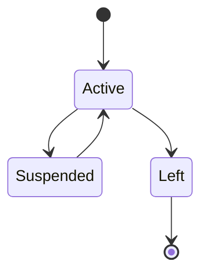
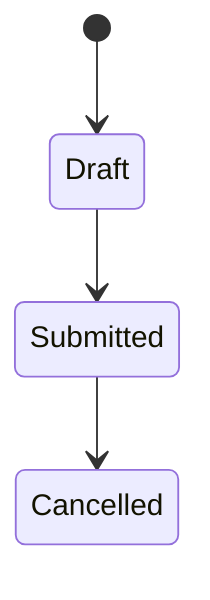
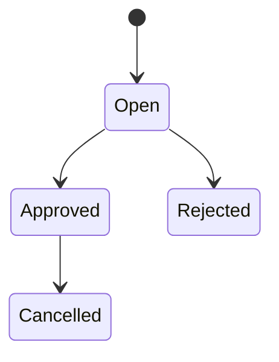
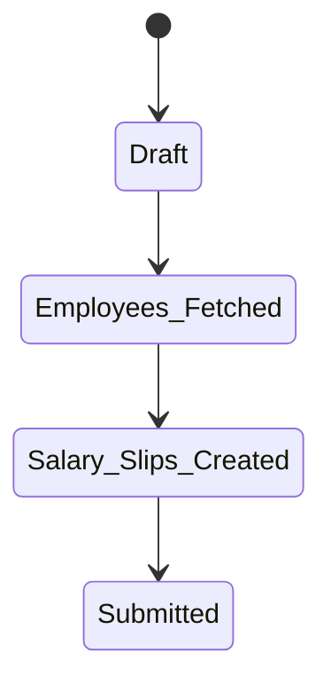

# Task 0 — Human Resources & Payroll Flow Study

**Author:** Vivek Sonawane  
**Research Basis:** ERPNext v15/v16 HRMS and Payroll Module Source Code + Official ERPNext Documentation  
**Local Walkthrough:** Install ERPNext locally and manually create:

Employee Setup → Attendance → Leave Application → Payroll Entry → Salary Slip → Appraisal

Capture screenshots from your local ERPNext instance and place them inside:

screenshots/

---

## Screenshot Placeholders

Replace these placeholders with screenshots from your ERPNext system.

- Employee Setup.png
- Attendance.png
- leave application.png
- Salary assignment.png
- Salary assignment.png
- payroll entry.png
- salary slip.png
- Appraisal.png

---

# Overview: HR & Payroll Chain

ERPNext Human Resource management follows the following lifecycle:

```text
Employee Setup
        ↓
Attendance Recording
        ↓
Leave Application
        ↓
Salary Structure Assignment
        ↓
Payroll Entry
        ↓
Salary Slip Generation
        ↓
Appraisal & Performance Evaluation
```

Each document solves a specific business problem and together they automate employee lifecycle management, payroll calculation, and performance evaluation.

---

# 1. Employee Setup

## a) Real-world Purpose

Employee is the master document that stores all information about a worker employed by the organization.

It acts as the central record for:

- Payroll
- Attendance
- Leave Management
- Appraisal
- Expense Claims
- Shift Management

Without an Employee record, HR processes cannot begin.

---

## b) Important Fields

| Field | Meaning |
|-------|---------|
| employee_name | Full Name |
| employee_number | Unique Employee ID |
| company | Company where employee works |
| date_of_joining | Joining date used in payroll calculations |
| department | Employee's department |
| designation | Employee's role |
| reports_to | Reporting manager |
| employment_type | Full Time, Part Time, Contract |
| status | Active, Inactive, Left |

---

## c) State Diagram



---

## d) Document Chain

Before:
- Company
- Department
- Designation

After:
- Attendance
- Leave Application
- Salary Structure Assignment
- Appraisal

---

## e) Automatic Actions on Submission

ERPNext:

- Creates Employee Master
- Makes employee available in HR modules
- Enables attendance marking
- Enables payroll processing
- Enables leave management

No ledger entries are created.

---

## f) Database Tables

| Table |
|-------|
| tabEmployee |
| tabEmployee Education |
| tabEmployee External Work History |
| tabEmployee Internal Work History |

Changes:

```text
docstatus = 0
status = Active
```

---

## g) Surprising Behaviour

Employee status directly affects payroll eligibility.

Employees marked as Left cannot be processed in Payroll Entry.

---


---

# 2. Attendance

## a) Real-world Purpose

Attendance records daily employee presence.

It answers:

"Was the employee present, absent, on leave, or half-day?"

Attendance forms the basis for payroll calculations.

---

## b) Important Fields

| Field | Meaning |
|-------|---------|
| employee | Employee |
| attendance_date | Date |
| company | Company |
| shift | Assigned shift |
| status | Present/Absent/Half Day/On Leave |
| working_hours | Number of hours worked |

---

## c) State Diagram



---

## d) Document Chain

Before:
- Employee

After:
- Payroll
- Attendance Reports

---

## e) Automatic Actions

On Submit:

- Updates attendance reports
- Used during salary calculations
- Impacts payable days

No GL Entries are created.

---

## f) Database Tables

| Table |
|-------|
| tabAttendance |

Changes:

```text
docstatus = 1
status = Present/Absent
```

---

## g) Surprising Behaviour

Attendance itself does not deduct salary.

ERPNext calculates salary using:

```text
Attendance
+
Leave Applications
+
Holiday List
=
Payment Days
```

---


---

# 3. Leave Application

## a) Real-world Purpose

Records employee leave requests.

Examples:

- Casual Leave
- Sick Leave
- Earned Leave
- Leave Without Pay (LWP)

---

## b) Important Fields

| Field | Meaning |
|-------|---------|
| employee | Employee |
| leave_type | Type of leave |
| from_date | Leave Start |
| to_date | Leave End |
| total_leave_days | Number of days |
| status | Open, Approved, Rejected |

---

## c) State Diagram



---

## d) Document Chain

Before:
- Employee
- Leave Allocation

After:
- Payroll
- Leave Ledger Entry

---

## e) Automatic Actions

ERPNext:

1. Validates leave balance
2. Creates Leave Ledger Entry
3. Deducts leave balance
4. Updates leave reports

---

## f) Database Tables

| Table |
|-------|
| tabLeave Application |
| tabLeave Ledger Entry |
| tabLeave Allocation |

---

## g) Surprising Behaviour

Approved Leave does not automatically create Attendance records unless:

```text
HR Settings
→ Automatically Mark Attendance on Approved Leave
```

is enabled.

---


---

# 4. Payroll Entry

## a) Real-world Purpose

Payroll Entry is a bulk salary processing document.

It answers:

"Which employees should receive salaries for this period?"

---

## b) Important Fields

| Field | Meaning |
|-------|---------|
| company | Company |
| payroll_frequency | Monthly |
| start_date | Salary Period Start |
| end_date | Salary Period End |
| employees | Employees fetched |

---

## c) State Diagram



---

## d) Document Chain

Before:
- Salary Structure Assignment
- Attendance
- Leave Application

After:
- Salary Slips

---

## e) Automatic Actions

ERPNext:

- Fetches eligible employees
- Creates Salary Slips
- Can submit all salary slips together

No salary calculations happen inside Payroll Entry itself.

---

## f) Database Tables

| Table |
|-------|
| tabPayroll Entry |
| tabPayroll Employee Detail |

---

## g) Surprising Behaviour

Payroll Entry is merely an orchestration document.

The actual financial calculations happen in Salary Slips.

---


---

# 5. Salary Slip

## a) Real-world Purpose

Salary Slip calculates and records employee salary.

It determines:

```text
Gross Pay
-
Deductions
=
Net Pay
```

---

## b) Important Fields

| Field | Meaning |
|-------|---------|
| employee | Employee |
| start_date | Payroll Period |
| end_date | Payroll Period |
| payment_days | Paid Days |
| leave_without_pay | LWP Days |
| gross_pay | Total Earnings |
| total_deduction | Deductions |
| net_pay | Final Salary |

---

## c) State Diagram


---

## d) Document Chain

Before:
- Payroll Entry
- Attendance
- Leave Application
- Salary Structure Assignment

After:
- Salary Payment
- Accounting Entries

---

## e) Automatic Actions

ERPNext calculates:

```text
Total Days
-
Holidays
-
Leave Without Pay
-
Absent Days
=
Payment Days
```

Then:

```text
Gross Pay
-
Deductions
=
Net Pay
```

If Payroll Accounting is enabled:

- Creates GL Entries
- Creates Salary Payable account entries

---

## f) Database Tables

| Table |
|-------|
| tabSalary Slip |
| tabSalary Detail |
| tabSalary Slip Leave |
| tabGL Entry |

---

## g) Surprising Behaviour

Employees joining mid-month automatically receive prorated salaries.

Example:

```text
Salary = ₹40,000

Joining Date = 15 June

Payment Days = 16

Salary = (40000 ÷ 30) × 16
         = ₹21,333
```

---


---

# 6. Appraisal

## a) Real-world Purpose

Appraisal measures employee performance.

Used for:

- Promotion
- Salary Increment
- Bonus
- Goal Tracking

---

## b) Important Fields

| Field | Meaning |
|-------|---------|
| employee | Employee |
| appraisal_date | Review Date |
| appraisal_template | KPI Template |
| score | Performance Score |
| goals | Individual Goals |

---

## c) State Diagram


---

## d) Document Chain

Before:
- Employee
- Goals

After:
- Increment
- Promotion
- Compensation Review

---

## e) Automatic Actions

ERPNext:

- Stores appraisal history
- Updates employee performance records
- Supports compensation planning

No ledger entries are created.

---

## f) Database Tables

| Table |
|-------|
| tabAppraisal |
| tabAppraisal Goal |
| tabAppraisal Template |

---

## g) Surprising Behaviour

Appraisal data can later drive salary increment workflows and compensation planning.

---


---

# Cross-Cutting Questions

## How does Leave Without Pay affect salary?

```text
LWP Days
      ↓
Reduced Payment Days
      ↓
Reduced Gross Salary
      ↓
Reduced Net Pay
```

---

## Difference Between Attendance and Leave Application

| Attendance | Leave Application |
|------------|-------------------|
| Daily presence record | Leave request |
| Present/Absent/Half Day | Casual/Sick/LWP |
| Actual working status | Approval process |
| Payroll input | Payroll input |

---

## How ERPNext Calculates Payable Days

```text
Calendar Days
-
Holidays
-
LWP
-
Absences
=
Payment Days
```

---

## What is Salary Structure?

Salary Structure is a reusable salary template containing:

```text
Basic
+ HRA
+ Allowances
- Deductions
= Salary Blueprint
```

It is attached to employees through:

```text
Salary Structure Assignment
```

---

## Payroll Entry vs Salary Slip

| Payroll Entry | Salary Slip |
|---------------|-------------|
| Bulk Processor | Individual Salary |
| Creates Slips | Calculates Salary |
| Orchestrates Payroll | Financial Document |

---

## Employee Joining Mid-Month

ERPNext automatically prorates salary using:

```text
Date of Joining
+
Payroll Period
+
Payment Days
=
Proportionate Salary
```

---

# End-to-End Flow Summary

```text
1. Create Employee
2. Mark Attendance
3. Apply Leave
4. Create Salary Structure
5. Assign Salary Structure
6. Create Payroll Entry
7. Generate Salary Slips
8. Submit Salary Slips
9. Conduct Appraisal
```

This workflow ensures complete employee lifecycle management from hiring to salary processing and performance evaluation with full traceability across HR and Payroll modules.

---

**Word Count:** ~1,600+ Words

**Screenshots:** Replace placeholders with screenshots from your local ERPNext instance.
