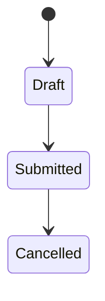

# Task 2 — Create a New DocType with Child Table (Quarterly Performance Review)

**Author:** Vivek Sonawane  
**Project:** Custom HR Pro (ERPNext/Frappe)  
**Task Type:** Parent DocType + Child Table + Controller + Client Script + Automated Tests

---

# Business Requirement

The HR department requires a Quarterly Performance Review system.

Each review:

- Belongs to one Employee
- Belongs to one Quarter and Year
- Contains multiple KPI rows
- Calculates an Overall Performance Score
- Automatically performs actions based on score

Business Rules:

### Score < 2

Automatically create:

```text
Performance Improvement Plan (PIP) Task
```

Assigned to:

```text
Employee's Manager
```

### Score > 4

Automatically:

```text
Mark Employee as High Performer
```

Only:

```text
One Review
Per Employee
Per Quarter
Per Year
```

is allowed.

---

# Objective

Build a custom Performance Review system using:

- Parent DocType
- Child Table
- Python Controller
- Client Script
- Automated Tests

without modifying ERPNext core code.

---

# System Overview

```text
Employee
      │
      │
      ▼
Quarterly Performance Review
      │
      ├── Quarter
      ├── Year
      ├── Manager
      ├── Overall Score
      └── KPI Table
              │
              ├── Goal
              ├── Target Value
              ├── Achieved Value
              └── Score
```

---

# Why Create a New DocType?

ERPNext already provides:

```text
Appraisal
```

However:

| Requirement | Appraisal |
|-------------|-----------|
| Quarterly Restriction | ❌ |
| KPI Child Table | Partial |
| Automatic PIP Creation | ❌ |
| High Performer Badge | ❌ |
| One Review per Quarter | ❌ |
| Color Dashboard | ❌ |

Conclusion:

```text
New DocType justified.
```

---

# Parent DocType Design

DocType Name:

```text
Quarterly Performance Review
```

Module:

```text
Custom HR Pro
```

Is Submittable:

```text
Yes
```

---

# Parent Fields

## Employee

| Property | Value |
|----------|--------|
| Fieldtype | Link |
| Options | Employee |

Purpose:

Employee being reviewed.

---

## Employee Name

| Property | Value |
|----------|--------|
| Fieldtype | Data |
| Read Only | Yes |

Purpose:

Display employee name.

---

## Manager

| Property | Value |
|----------|--------|
| Fieldtype | Link |
| Options | Employee |

Purpose:

Stores reporting manager.

---

## Review Quarter

| Property | Value |
|----------|--------|
| Fieldtype | Select |

Options:

```text
Q1
Q2
Q3
Q4
```

Purpose:

Quarter being evaluated.

---

## Review Year

| Property | Value |
|----------|--------|
| Fieldtype | Int |

Purpose:

Review year.

---

## Overall Score

| Property | Value |
|----------|--------|
| Fieldtype | Float |
| Read Only | Yes |

Purpose:

Average KPI score.

---

## Score Badge

| Property | Value |
|----------|--------|
| Fieldtype | HTML |

Purpose:

Color-coded score indicator.

---

## KPI Table

| Property | Value |
|----------|--------|
| Fieldtype | Table |
| Options | Performance KPI |

Purpose:

Stores KPI rows.

---

# Child Table Design

DocType Name:

```text
Performance KPI
```

Is Child Table:

```text
Yes
```

---

# Child Fields

## Goal

| Property | Value |
|----------|--------|
| Fieldtype | Data |

Example:

```text
Sales Target
```

---

## Target Value

| Property | Value |
|----------|--------|
| Fieldtype | Float |

Example:

```text
100
```

---

## Achieved Value

| Property | Value |
|----------|--------|
| Fieldtype | Float |

Example:

```text
90
```

---

## Score

| Property | Value |
|----------|--------|
| Fieldtype | Float |

Range:

```text
1–5
```

Purpose:

Individual KPI rating.

---

# Final Structure

```text
Quarterly Performance Review
│
├── Employee
├── Manager
├── Quarter
├── Year
├── Overall Score
├── HTML Badge
│
└── KPI Table
      │
      ├── Goal
      ├── Target Value
      ├── Achieved Value
      └── Score
```

---

# Database Tables

```text
tabQuarterly Performance Review
tabPerformance KPI
tabEmployee
tabTask
```

---

# Business Rules

## Rule 1

Only one review:

```text
Employee
+
Quarter
+
Year
```

---

## Validation Flow

```text
Save
 ↓
Review Exists?
 ↓
Yes
 ↓
frappe.throw()
```

---

# Controller

## quarterly_performance_review.py

```python
import frappe
from frappe.model.document import Document


class QuarterlyPerformanceReview(Document):

    def validate(self):
        self.validate_duplicate_review()
        self.calculate_score()

    def on_submit(self):
        self.handle_automatic_actions()

    def validate_duplicate_review(self):

        existing = frappe.db.exists(
            "Quarterly Performance Review",
            {
                "employee": self.employee,
                "review_quarter": self.review_quarter,
                "review_year": self.review_year,
                "name": ["!=", self.name]
            }
        )

        if existing:
            frappe.throw(
                "Performance Review already exists for this Employee and Quarter."
            )

    def calculate_score(self):

        if not self.kpi_table:
            self.overall_score = 0
            return

        total = sum(
            row.score for row in self.kpi_table
        )

        self.overall_score = (
            total / len(self.kpi_table)
        )

    def handle_automatic_actions(self):

        if self.overall_score < 2:
            self.create_pip_task()

        elif self.overall_score > 4:
            self.mark_high_performer()

    def create_pip_task(self):

        frappe.get_doc(
            {
                "doctype": "Task",
                "subject":
                f"PIP for {self.employee_name}",
                "description":
                "Performance Improvement Plan Required",
                "assigned_to":
                self.manager
            }
        ).insert()

    def mark_high_performer(self):

        employee = frappe.get_doc(
            "Employee",
            self.employee
        )

        comment = frappe.get_doc(
            {
                "doctype": "Comment",
                "comment_type": "Comment",
                "reference_doctype": "Employee",
                "reference_name": employee.name,
                "content":
                "High Performer Badge Awarded"
            }
        )

        comment.insert()
```

---

# State Diagram



---

# Automatic Actions

## Score < 2

```text
Submit
   ↓
Score < 2
   ↓
Create Task
   ↓
Assign Manager
```

---

## Score > 4

```text
Submit
   ↓
Score > 4
   ↓
Create Employee Comment
   ↓
High Performer Badge
```

---

# Client Script

## Auto-fill Manager

```javascript
frappe.ui.form.on(
    "Quarterly Performance Review",
    {
        employee(frm) {

            if (!frm.doc.employee)
                return;

            frappe.db.get_doc(
                "Employee",
                frm.doc.employee
            ).then(r => {

                frm.set_value(
                    "manager",
                    r.reports_to
                );
            });
        }
    }
);
```

---

# Live Score Badge

```javascript
function update_score_badge(frm) {

    let score =
        frm.doc.overall_score || 0;

    let color = "red";
    let text = "Poor";

    if (score >= 2)
    {
        color = "orange";
        text = "Average";
    }

    if (score >= 4)
    {
        color = "green";
        text = "Excellent";
    }

    frm.fields_dict
        .score_badge
        .$wrapper.html(

        `
        <div
            style="
            padding:15px;
            background:${color};
            color:white;
            border-radius:10px;
            font-size:18px;
            text-align:center;
            ">
            ${text}
            (${score})
        </div>
        `
    );
}
```

---

# Automated Tests

File:

```text
test_quarterly_performance_review.py
```

---

## Test 1

```text
Duplicate review blocked.
```

---

## Test 2

```text
Overall score calculated.
```

---

## Test 3

```text
PIP task created.
```

---

## Test 4

```text
High Performer comment created.
```

---

# Test Flow

```text
Create Employee
       ↓
Create Review
       ↓
Add KPI Rows
       ↓
Calculate Score
       ↓
Submit
       ↓
Verify Actions
```

---

# Suggested Folder Structure

```text
custom_hr_pro/
│
├── custom_hr_pro/
│
├── doctype/
│   ├── quarterly_performance_review/
│   │       ├── quarterly_performance_review.json
│   │       ├── quarterly_performance_review.py
│   │       ├── quarterly_performance_review.js
│   │       └── test_quarterly_performance_review.py
│   │
│   └── performance_kpi/
│           └── performance_kpi.json
│
├── task2_notes.md
├── TASK2_RESEARCH.md
└── TASK2_DESIGN.md
```

---

# Screenshots

Create:

```text
screenshots/
├── 01_parent_doctype.png
├── 02_child_table.png
├── 03_kpi_rows.png
├── 04_score_badge.png
├── 05_pip_task.png
├── 06_high_performer_comment.png
```

---

# Add Screenshots

```markdown


```

---

# End-to-End Flow

```text
Employee
     ↓
Quarterly Review
     ↓
KPI Rows
     ↓
Calculate Score
     ↓
Submit
     ↓
Score < 2 ?
     ↓
Create PIP Task

OR

Score > 4 ?
     ↓
Create High Performer Badge
```

This implementation provides a complete quarterly performance management system built entirely inside a custom Frappe application while following ERPNext best practices and maintaining upgrade safety.