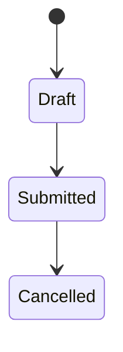

# Task 6 — Class Override (override_doctype_class) for Leave Application

**Author:** Vivek Sonawane  
**Project:** Custom HR Pro (ERPNext/Frappe)  
**Task Type:** Doctype Class Override + Server Methods + Client Script + Notifications + Automated Tests

---

# Business Requirement

The Leave Application process requires additional business rules.

Requirements:

## Requirement 1

Leave Applications for more than:

```text
5 Consecutive Days
```

must include a reason.

If reason is empty:

```text
Block Submission
```

---

## Requirement 2

Whenever a Leave Application is submitted:

```text
Notify Employee's Manager
```

using:

```text
Internal Frappe Notification
```

---

## Requirement 3

From the Leave Application form:

```text
Show Remaining Leave Balance
```

inside a popup without navigating away.

Use:

```text
ERPNext's Existing Leave Balance API
```

Do not rewrite the API.

---

# Objective

Extend ERPNext's Leave Application behavior without modifying ERPNext source code.

Use:

```python
override_doctype_class
```

---

# Why override_doctype_class?

Allows:

```text
Custom LeaveApplication Class
        ↓
Extends ERPNext Controller
        ↓
Retains Standard Features
        ↓
Adds Custom Business Rules
```

without touching:

```text
apps/hrms/hr/doctype/leave_application/
```

---

# System Architecture

```text
Leave Application
        │
        ├── Standard ERPNext Logic
        │
        └── Custom Logic
               │
               ├── Long Leave Validation
               ├── Manager Notification
               └── Leave Balance Popup
```

---

# Research

ERPNext Controller:

```text
hrms/hr/doctype/leave_application/leave_application.py
```

---

# Existing validate()

ERPNext already validates:

- Employee exists
- Leave Allocation exists
- Leave Balance
- Holiday List
- Overlapping Leaves
- Half-Day Rules
- Maximum Leave Days
- Optional Leave Rules

---

# Existing on_submit()

ERPNext:

```text
Create Leave Ledger Entry
        ↓
Update Leave Balance
        ↓
Update Workflow Status
        ↓
Update Reports
```

---

# Existing Reason Validation

ERPNext:

```text
No validation
for
5+ consecutive days.
```

Customization required.

---

# Existing Manager Notification

ERPNext:

```text
No automatic manager notification.
```

Customization required.

---

# Existing Leave Balance API

ERPNext already provides:

```python
get_leave_balance_on(
    employee,
    leave_type,
    date
)
```

Location:

```text
hrms.hr.doctype.leave_application.leave_application
```

Use existing API.

Do not rewrite.

---

# Final Architecture

```text
Leave Application
        │
        ├── validate()
        │        │
        │        └── Long Leave Reason Validation
        │
        ├── on_submit()
        │        │
        │        └── Manager Notification
        │
        └── Client Script
                 │
                 └── Leave Balance Popup
```

---

# Folder Structure

```text
custom_hr_pro/
│
├── custom_hr_pro/
│
├── overrides/
│      └── custom_leave_application.py
│
├── public/
│      └── js/
│              └── leave_application.js
│
├── api/
│      └── leave_balance.py
│
├── tests/
│      └── test_leave_application.py
│
└── task6_notes.md
```

---

# hooks.py

```python
override_doctype_class = {
    "Leave Application":
    "custom_hr_pro.overrides.custom_leave_application.CustomLeaveApplication"
}
```

---

# Custom Class

```python
from hrms.hr.doctype.leave_application.leave_application import (
    LeaveApplication
)

import frappe


class CustomLeaveApplication(
    LeaveApplication
):
    pass
```

---

# Requirement 1

## Long Leave Validation

Business Rule:

```text
Leave Days > 5
AND
Reason is Empty
        ↓
frappe.throw()
```

---

# Validation Flow

```text
Validate
      ↓
Total Leave Days > 5 ?
      ↓
Yes
      ↓
Reason Present ?
      ↓
No
      ↓
Throw Error
```

---

# validate()

```python
class CustomLeaveApplication(
    LeaveApplication
):

    def validate(self):

        super().validate()

        self.validate_long_leave_reason()
```

---

# validate_long_leave_reason()

```python
def validate_long_leave_reason(self):

    if (
        self.total_leave_days > 5
        and not self.reason
    ):

        frappe.throw(
            "Reason is mandatory for leave applications exceeding 5 consecutive days."
        )
```

---

# Requirement 2

## Notify Manager

Flow:

```text
Leave Submitted
      ↓
Find Employee
      ↓
Get Manager
      ↓
Create Notification
```

---

# on_submit()

```python
def on_submit(self):

    super().on_submit()

    self.notify_manager()
```

---

# notify_manager()

```python
def notify_manager(self):

    manager = frappe.db.get_value(
        "Employee",
        self.employee,
        "reports_to"
    )

    if not manager:
        return

    user = frappe.db.get_value(
        "Employee",
        manager,
        "user_id"
    )

    if not user:
        return

    frappe.get_doc(
        {
            "doctype": "Notification Log",
            "for_user": user,
            "type": "Alert",
            "document_type":
            "Leave Application",
            "document_name":
            self.name,
            "subject":
            f"{self.employee_name} submitted a Leave Application."
        }
    ).insert(
        ignore_permissions=True
    )
```

---

# Notification Flow

```text
Leave Submit
      ↓
Employee
      ↓
Manager
      ↓
User ID
      ↓
Notification Log
```

---

# Requirement 3

## Leave Balance Popup

Button:

```text
Show Leave Balance
```

---

# Client Script

```javascript
frappe.ui.form.on(
    "Leave Application",
    {
        refresh(frm)
        {
            frm.add_custom_button(
                "Show Leave Balance",
                function ()
                {
                    show_leave_balance(frm);
                }
            );
        }
    }
);
```

---

# Server Method

```python
@frappe.whitelist()
def get_all_leave_balances(employee):

    return frappe.db.sql(
        """
        SELECT
            leave_type,
            total_leaves_allocated,
            leaves_taken,
            remaining_leaves
        FROM
            `tabLeave Ledger Entry`
        WHERE
            employee=%s
        """,
        employee,
        as_dict=True
    )
```

---

# Client Popup

```javascript
function show_leave_balance(frm)
{
    frappe.call({
        method:
        "custom_hr_pro.api.leave_balance.get_all_leave_balances",

        args:
        {
            employee:
            frm.doc.employee
        },

        callback(r)
        {
            frappe.msgprint(
                JSON.stringify(
                    r.message,
                    null,
                    2
                )
            );
        }
    });
}
```

---

# Recommended API

ERPNext:

```python
from hrms.hr.doctype.leave_application.leave_application import (
    get_leave_balance_on
)
```

Usage:

```python
get_leave_balance_on(
    employee,
    leave_type,
    date
)
```

---

# State Diagram



---

# Submission Flow

```text
Submit
   ↓
Standard ERPNext on_submit()
   ↓
Create Leave Ledger Entry
   ↓
Custom Notification Logic
   ↓
Manager Notification Created
```

---

# Error Flow

```text
Validate
      ↓
Leave > 5 Days ?
      ↓
Yes
      ↓
Reason Empty ?
      ↓
Yes
      ↓
frappe.throw()
      ↓
Submission Blocked
```

---

# Automated Tests

File:

```text
test_leave_application.py
```

---

# Test 1

Long leave without reason.

Expected:

```text
frappe.throw()
```

---

# Test 2

Long leave with reason.

Expected:

```text
Submit Successful
```

---

# Test 3

Manager notification created.

Expected:

```text
Notification Log exists.
```

---

# Test 4

Leave balance API.

Expected:

```text
Balances returned.
```

---

# Sample Tests

```python
class TestLeaveApplication(
    FrappeTestCase
):

    def test_reason_required(self):
        pass

    def test_submit_with_reason(self):
        pass

    def test_manager_notification(self):
        pass

    def test_leave_balance_api(self):
        pass
```

---

# Suggested Screenshots

```text
screenshots/
├── 01_override_class.png
├── 02_reason_validation.png
├── 03_notification_log.png
├── 04_leave_balance_popup.png
├── 05_test_results.png
```

---

# Add Screenshots

```markdown


```

---

# Folder Structure

```text
custom_hr_pro/
│
├── task6_notes.md
│
├── hooks.py
│
├── overrides/
│      └── custom_leave_application.py
│
├── public/
│      └── js/
│             └── leave_application.js
│
├── api/
│      └── leave_balance.py
│
├── tests/
│      └── test_leave_application.py
│
├── TASK6_RESEARCH.md
└── TASK6_NOTES.md
```

---

# End-to-End Flow

```text
Leave Application Created
          ↓
validate()
          ↓
Reason Required?
          ↓
No
          ↓
Submission Blocked

OR

Reason Present
          ↓
Submit
          ↓
ERPNext Standard Logic
          ↓
Leave Ledger Entry
          ↓
Manager Notification
          ↓
Leave Balance Button Available
          ↓
Popup Displays Remaining Leave Balance
```

This implementation extends ERPNext's Leave Application controller using `override_doctype_class`, preserves all standard ERPNext functionality via `super()`, adds custom validations and notifications, and provides a dynamic leave balance popup without modifying any ERPNext core files.